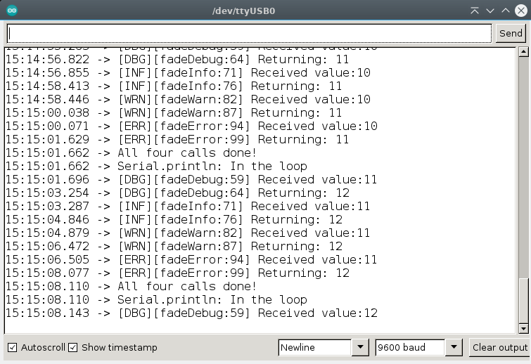

[](https://github.com/berrak/Rdebug/blob/master/LICENSE)
[](https://github.com/berrak/Rdebug/releases/latest)
[](https://github.com/berrak/Rdebug/releases/latest)
[](https://github.com/berrak/Rdebug/stargazers)
[](https://github.com/berrak/Rdebug/issues)


# A handy library to smash out Arduino bugs

As in many similar debugging frameworks, the `Rdebug library` defines different `debug levels`. Turn the serial monitor debugging output `On` and `Off` with a simple `#define`.

```
ON < DEBUG < INFO < WARN < ERROR
```

The heart of the library is the hierarchy. Set the log level to `WARN`, then the `lower` groups are also included. In this case, it enables `ON`, `DEBUG`, and `INFO`.

Set the level to the highest level, i.e., `ERROR` during development, and reduce it once the code is released.

If the level is `OFF`, then all debug macros are disabled, and only the usual Arduino serial print statement emits any text to the user.

If the level is `ON`, a.k.a. `lazy mode`, you can use the `debug` and the `debugln` macros to save you from typing in `Serial.print` and `Serial.println` all the time. The macro expands to the latter two functions.

# Debug levels

The library includes the following defined levels:

```
DEBUGLEVEL_OFF - all debug macros are disabled
DEBUGLEVEL_ON - the non-traced macro (lazy mode) is enabled

DEBUGLEVEL_DEBUG - traced debug messages
DEBUGLEVEL_INFO - traced information messages
DEBUGLEVEL_WARN - traced warning messages
DEBUGLEVEL_ERROR - traced error messages
```

The latter four are identical and produce a slightly different monitor output. You, as the user, decide how to apply these in the code such that it makes sense. They all have the following generic form.

```
[level][function name:line number] "string message"
```
The traced macros end with `D`, `I`, `W`, and `E` for their log level.

```
debugD(), debuglnD()    // DEBUGLEVEL_DEBUG
debugI(), debuglnI()    // DEBUGLEVEL_INFO
debugW(), debuglnW()    // DEBUGLEVEL_WARN
debugE(), debuglnE()    // DEBUGLEVEL_ERROR
```

The `lazy` non-trace macro does not have these letters at the end.
```
debug()   ---> Serial.print()   // DEBUGLEVEL_ON
debugln() ---> Serial.println() // DEBUGLEVEL_ON
```

# Usage

Initially, in your sketch, set the debugging level to `DEBUGLEVEL_ERROR` so that **all** debugging messages appear:

```
#define DEBUGLEVEL_ERROR
```
Then include the header file:
```
#include <Rdebug.h>
```

# Run the example code
Experiment with different debug levels to include or exclude the above debug statements with the sketch `Rdebug.ino` in the examples folder.

# Credits
Thanks to `Ralph S Bacon` for his enjoyable [YT channel](https://www.youtube.com/@RalphBacon) with many valuable tips and hints related to microcontrollers, coding, and everything related to the Arduino echo system.

# References
Ralph's repository and his original [debugging](https://github.com/RalphBacon/224-Superior-Serial.print-statements) implementation.

